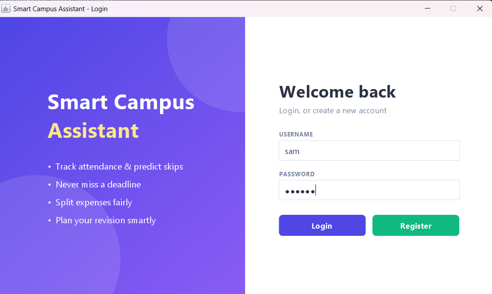
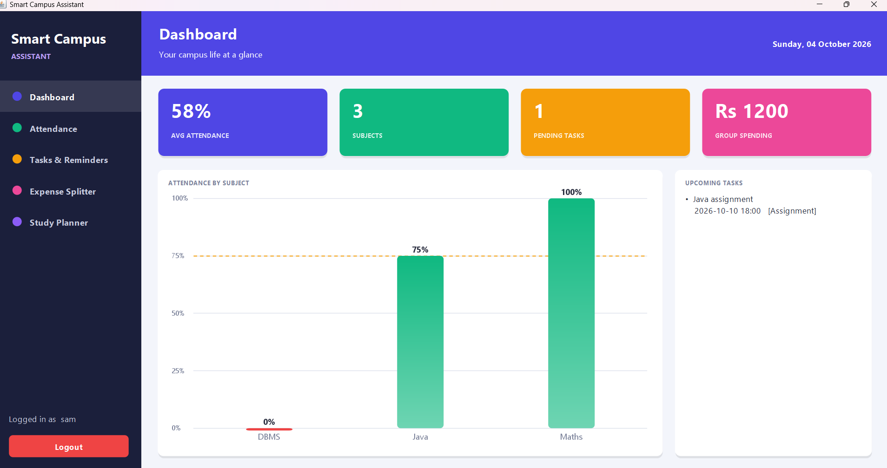
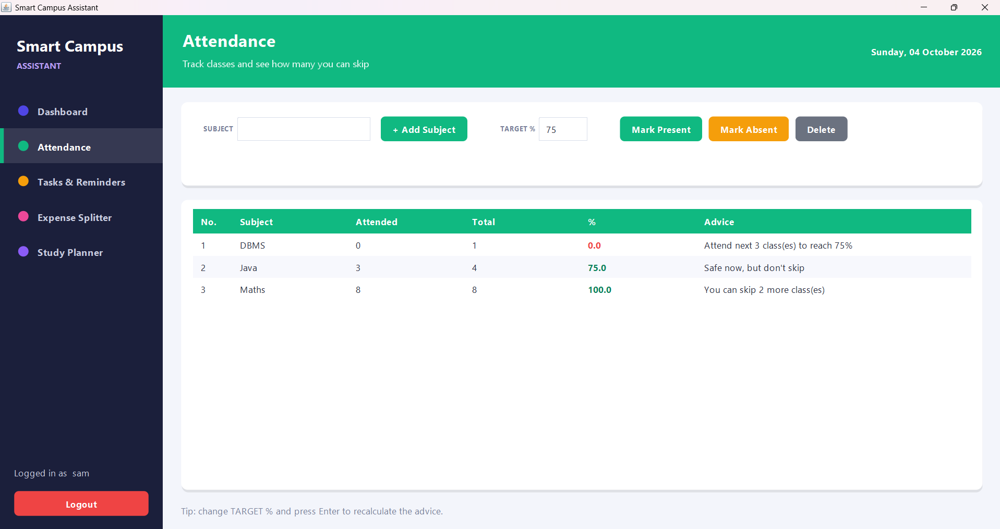
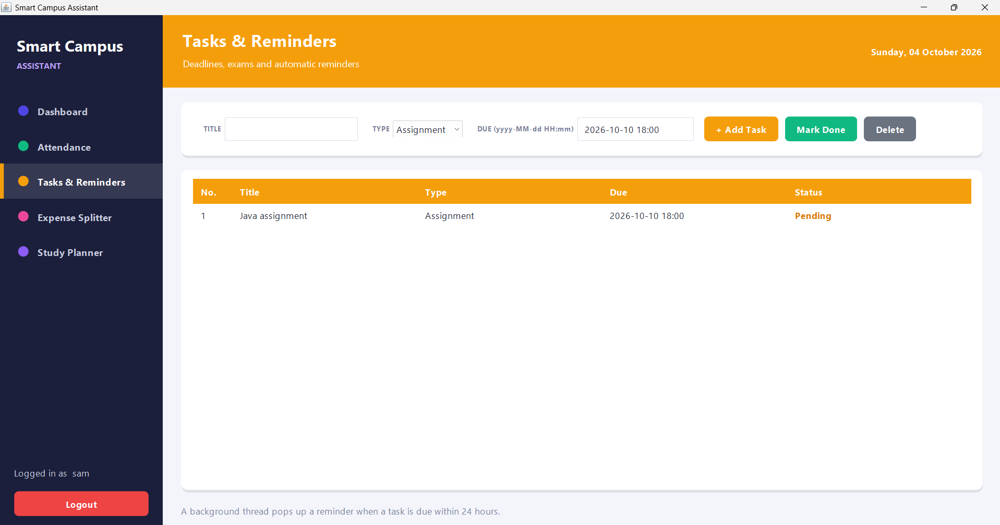
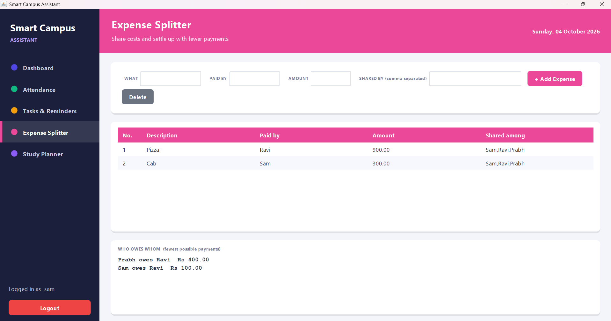
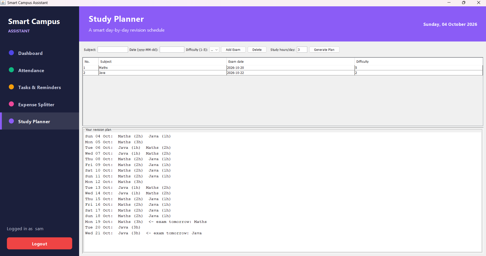

# Smart Campus Assistant
## Screenshots








A Java desktop application (Swing + MySQL + JDBC) that helps students manage campus life.

## Features
| Module | What it does |
|---|---|
| Login / Register | Salted SHA-256 password hashing, each user sees only their own data |
| Attendance | Tracks classes and tells you how many you can skip / must attend to hit the target % |
| Tasks & Reminders | Deadlines + a background thread that pops up alerts |
| Expense Splitter | Shared expenses -> minimum "who owes whom" payments |
| Study Planner | Day-by-day revision plan weighted by subject difficulty |
| Dashboard | Summary numbers + hand-drawn attendance bar chart |

## Tech stack
Java 17+, Swing, MySQL 8, JDBC (mysql-connector-j), Maven, Git/GitHub Actions

---

## 1. Prerequisites
- JDK 17 or newer  -> check with `java -version`
- Maven            -> check with `mvn -v` (download from maven.apache.org and add `bin` to PATH)
- VS Code + "Extension Pack for Java"
- Git
- MySQL Server 8 + MySQL Workbench (you already have these)

## 2. Folder structure (create exactly this)
```
smart-campus-assistant/
├── pom.xml
├── README.md
├── schema.sql                  (optional, for Workbench)
├── db.properties.example
├── db.properties               (YOUR password - never pushed to GitHub)
├── .gitignore
├── .github/workflows/build.yml
└── src/main/java/com/campus/
    ├── Main.java
    ├── Session.java
    ├── model/    Subject.java  Task.java  Expense.java  Exam.java
    ├── db/       Database.java
    ├── service/  AuthService.java  AttendanceCalculator.java  ExpenseSplitter.java
    │             StudyPlanner.java  ReminderService.java
    └── ui/       Refreshable.java  UiUtil.java  LoginFrame.java  MainFrame.java
                  DashboardPanel.java  AttendancePanel.java  TasksPanel.java
                  ExpensePanel.java  PlannerPanel.java
```
In VS Code: File > Open Folder > make an empty folder `smart-campus-assistant`, then create the folders and files above and paste each file's code.

## 3. Set up MySQL
1. Open **MySQL Workbench**, connect to your local server (usually `root@localhost:3306`).
2. Make sure the server is running.
3. (Optional) open `schema.sql` in Workbench and click the lightning bolt. The app creates the database `campus_db` and all tables by itself on first start, so this step is only for viewing/learning.
4. Copy `db.properties.example` to `db.properties` and put your real root password:
```
db.url=jdbc:mysql://localhost:3306/campus_db?createDatabaseIfNotExist=true&useSSL=false&allowPublicKeyRetrieval=true&serverTimezone=UTC
db.user=root
db.password=your_real_password
```

## 4. Run it
**VS Code:** open `Main.java` and click the **Run** link above `main`. The Java extension downloads the MySQL driver from `pom.xml` automatically.

**Terminal** (from the project folder):
```bash
mvn clean package
java -jar target/smart-campus-assistant-1.0.0.jar
```
Register an account, log in, and try every tab. Then in Workbench run `SELECT * FROM campus_db.users;` to see your data live in MySQL.

## 5. Push to GitHub
Create an EMPTY repository on github.com first (no README), then:
```bash
git init
git add .
git commit -m "Initial commit: Smart Campus Assistant"
git branch -M main
git remote add origin https://github.com/YOUR-USERNAME/smart-campus-assistant.git
git push -u origin main
```
Check on GitHub that `db.properties` is NOT there (it is in `.gitignore`).
Tip: commit after each module ("Add attendance module", "Add expense splitter"...) so the history shows your progress.

## 6. Deployment
1. `mvn clean package` creates one runnable JAR: `target/smart-campus-assistant-1.0.0.jar`
2. Make a folder `SmartCampus/`, put the JAR and your `db.properties` inside, and run `java -jar smart-campus-assistant-1.0.0.jar` from that folder.
3. GitHub Actions (`.github/workflows/build.yml`) builds the JAR on every push (see the Actions tab).
4. On GitHub: Releases > Draft a new release > tag `v1.0.0` > upload the JAR. Mention in the notes that MySQL and `db.properties` are required.
5. Optional Windows installer: `jpackage --input target --main-jar smart-campus-assistant-1.0.0.jar --name SmartCampus --type exe`

---

## 7. Architecture (explain this in your viva)
```
ui/        what the user SEES (Swing screens)
  |
service/   the BRAINS (algorithms, business logic)
  |
db/        ONLY SQL lives here (JDBC -> MySQL)
model/     small data classes passed between layers
```

## 8. What each part teaches
| Order | File(s) | Concept / Subject |
|---|---|---|
| 1 | `pom.xml` | Maven, dependencies, packaging |
| 2 | `model/*` | OOP, encapsulation, Java records |
| 3 | `db/Database.java` | **DBMS + JDBC**, PreparedStatement (stops SQL injection), generics, lambdas, `synchronized` |
| 4 | `AuthService` | Security: salt + hash, exceptions |
| 5 | `AttendanceCalculator` | Math -> code |
| 6 | `ExpenseSplitter` | **Data structures**: Map, PriorityQueue, greedy algorithm |
| 7 | `StudyPlanner` | Collections, scoring, `LocalDate` |
| 8 | `ReminderService` | **Multithreading**: `ScheduledExecutorService`, daemon threads |
| 9 | `ui/*` | **GUI**: layouts, event handling, JTable, Graphics2D |

### The three algorithms
- **Attendance:** skip `x` classes and stay at target `p`%: `attended/(total+x) >= p/100`, so `x <= 100*attended/p - total`. Example: 18/20 at 75% -> skip up to 4.
- **Expense splitter:** compute each person's balance (paid - share). Repeatedly pair the biggest debtor with the biggest creditor -> fewest payments.
- **Study planner:** for each 1-hour slot pick the subject with the lowest `(hoursGiven+1)/difficulty`; nearer exams win ties.

### ER diagram (for your report)
`users (1) ──< subjects`, `users (1) ──< tasks`, `users (1) ──< expenses`, `users (1) ──< exams`
(every table has `user_id` as a foreign key to `users.id`, with ON DELETE CASCADE)

## 9. Troubleshooting
| Error | Fix |
|---|---|
| `Access denied for user 'root'` | Wrong password in `db.properties` |
| `Communications link failure` | MySQL server not running (start it from Windows Services or Workbench) |
| `Cannot read db.properties` | Create it in the project ROOT (next to `pom.xml`) |
| `No suitable driver` / `ClassNotFound` | Run `mvn clean package`, or in VS Code: Ctrl+Shift+P > "Java: Clean Java Language Server Workspace" |
| `mvn` not recognised | Install Maven and add its `bin` folder to PATH |
| Unsupported class version | Your JDK is older than 17; install JDK 17+ |

## 10. Ideas to extend (for extra marks)
CSV export of expenses, dark mode, email reminders, bcrypt instead of SHA-256 (say in the viva that real systems use bcrypt).